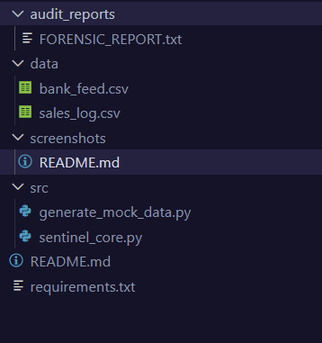
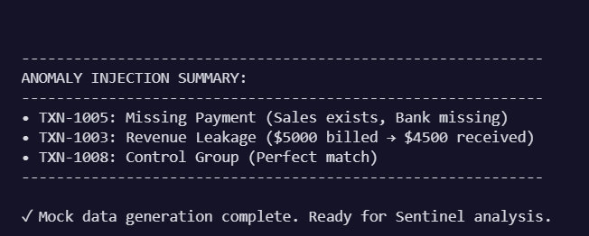
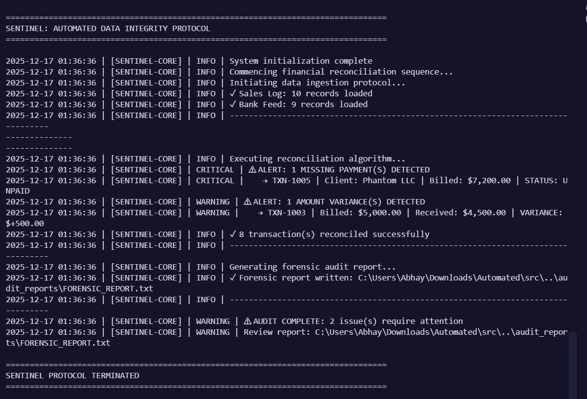
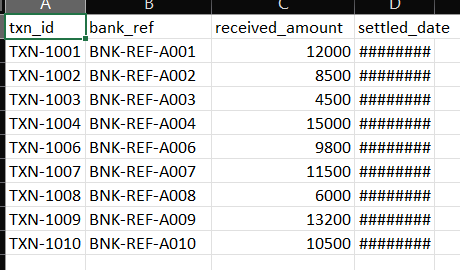
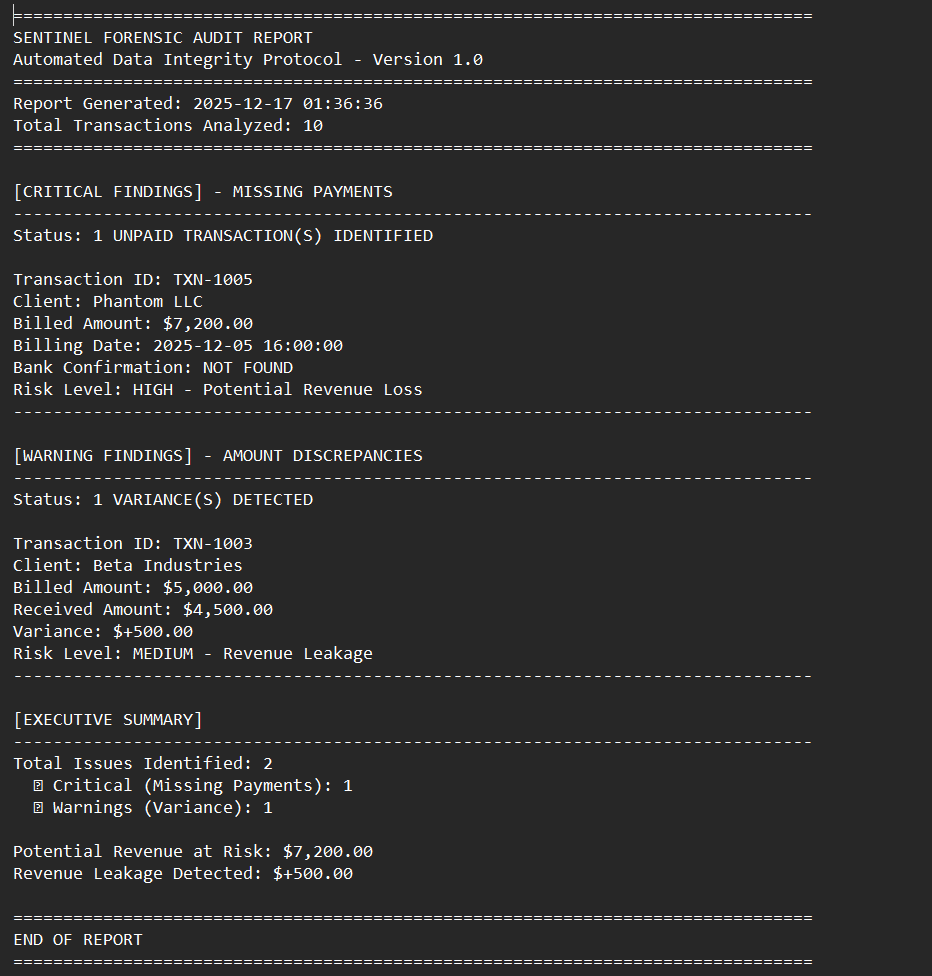

# SENTINEL: Automated Data Integrity Protocol

<div align="center">

**A Production-Grade Financial Reconciliation Engine**  
*Learning Project: Building Automated Data Quality Solutions*

[](https://www.python.org/)
[](https://pandas.pydata.org/)
[](LICENSE)

</div>

---

## Project Overview

**Sentinel** is an automated data quality tool that reconciles internal sales data against external bank payment feeds to detect financial discrepancies. This project explores practical applications of:

- **Script Maintenance** - Modular, maintainable Python codebase with logging  
- **Troubleshooting Data Issues** - Automated detection of missing payments and variances  
- **QA for Reports** - Forensic audit report generation with issue categorization  

---

## Business Problem

**Scenario:** A company bills clients for services but notices occasional payment discrepancies. Manual reconciliation is time-consuming and error-prone. 

**Solution:** Sentinel automates the comparison of:
- **Internal Sales Data** (What we billed)
- **External Bank Data** (What we received)

**Detected Anomalies:**
- **Missing Payments** - Invoices without corresponding bank confirmations
- **Revenue Leakage** - Partial payments or amount mismatches
- **Perfect Matches** - Control group for validation

---

## Architecture

```
Automated/
│
├── src/
│   ├── generate_mock_data.py   # Creates test datasets with injected errors
│   └── sentinel_core.py         # Main reconciliation engine
│
├── data/                        # Auto-generated CSVs
│   ├── sales_log.csv            # Internal billing records
│   └── bank_feed.csv            # External payment confirmations
│
├── audit_reports/               # Output directory
│   └── FORENSIC_REPORT.txt      # Detailed findings report
│
├── requirements.txt             # Python dependencies
└── README.md                    # This file
```

---

## Screenshots

### Project Structure

*Project directory layout showing organized file structure*

### Data Generation Output

*Mock data generator creating CSV files with intentional anomalies*

### Sentinel Analysis Execution

*Terminal output showing real-time anomaly detection with severity levels*

### Generated CSV Files

*Internal sales data (sales_log.csv) with billing records*


*External payment data (bank_feed.csv) with settlement confirmations*

### Forensic Audit Report

*Generated audit report showing detailed findings and executive summary*

---

## Quick Start

### Step 1: Install Dependencies
```bash
pip install -r requirements.txt
```

### Step 2: Generate Mock Data
```bash
python src/generate_mock_data.py
```

**Output:**
```
============================================================
SENTINEL DATA GENERATOR | Initializing Mock Datasets
============================================================

✓ Generated: data\sales_log.csv
✓ Generated: data\bank_feed.csv

------------------------------------------------------------
ANOMALY INJECTION SUMMARY:
------------------------------------------------------------
• TXN-1005: Missing Payment (Sales exists, Bank missing)
• TXN-1003: Revenue Leakage ($5000 billed → $4500 received)
• TXN-1008: Control Group (Perfect match)
------------------------------------------------------------

✓ Mock data generation complete. Ready for Sentinel analysis.
```

### Step 3: Run Sentinel Analysis
```bash
python src/sentinel_core.py
```

**Expected Terminal Output:**
```
================================================================================
SENTINEL: AUTOMATED DATA INTEGRITY PROTOCOL
================================================================================

2025-12-17 14:30:00 | [SENTINEL-CORE] | INFO | System initialization complete
2025-12-17 14:30:00 | [SENTINEL-CORE] | INFO | Commencing financial reconciliation sequence...
2025-12-17 14:30:00 | [SENTINEL-CORE] | INFO | Initiating data ingestion protocol...
2025-12-17 14:30:00 | [SENTINEL-CORE] | INFO | ✓ Sales Log: 10 records loaded
2025-12-17 14:30:00 | [SENTINEL-CORE] | INFO | ✓ Bank Feed: 9 records loaded
2025-12-17 14:30:01 | [SENTINEL-CORE] | INFO | Executing reconciliation algorithm...
2025-12-17 14:30:01 | [SENTINEL-CORE] | CRITICAL | ⚠ ALERT: 1 MISSING PAYMENT(S) DETECTED
2025-12-17 14:30:01 | [SENTINEL-CORE] | CRITICAL |    → TXN-1005 | Client: Phantom LLC | Billed: $7,200.00 | STATUS: UNPAID
2025-12-17 14:30:01 | [SENTINEL-CORE] | WARNING | ⚠ ALERT: 1 AMOUNT VARIANCE(S) DETECTED
2025-12-17 14:30:01 | [SENTINEL-CORE] | WARNING |    → TXN-1003 | Billed: $5,000.00 | Received: $4,500.00 | VARIANCE: +$500.00
2025-12-17 14:30:01 | [SENTINEL-CORE] | INFO | ✓ 8 transaction(s) reconciled successfully
--------------------------------------------------------------------------------
2025-12-17 14:30:01 | [SENTINEL-CORE] | INFO | Generating forensic audit report...
2025-12-17 14:30:01 | [SENTINEL-CORE] | INFO | ✓ Forensic report written: audit_reports\FORENSIC_REPORT.txt
--------------------------------------------------------------------------------
2025-12-17 14:30:01 | [SENTINEL-CORE] | WARNING | ⚠ AUDIT COMPLETE: 2 issue(s) require attention
2025-12-17 14:30:01 | [SENTINEL-CORE] | WARNING | Review report: audit_reports\FORENSIC_REPORT.txt

================================================================================
SENTINEL PROTOCOL TERMINATED
================================================================================
```

### Step 4: Review Forensic Report
Check `audit_reports/FORENSIC_REPORT.txt` for detailed findings.

---

## Key Features

| Feature | Description | Technical Focus |
|---------|-------------|----------------|
| **Automated Anomaly Detection** | Identifies missing payments via left join analysis | Data Analysis & Pandas Operations |
| **Enterprise Logging** | Structured logging with severity levels (INFO/WARNING/CRITICAL) | Python Best Practices |
| **Forensic Reporting** | Generates audit-ready text reports with executive summaries | Report Automation |
| **Modular Design** | Separation of concerns (data generation, core logic, reporting) | Software Architecture |
| **Test Data Generator** | Controlled error injection for QA validation | Quality Assurance Techniques |

---

## Test Cases

| Transaction ID | Scenario | Expected Detection |
|----------------|----------|-------------------|
| **TXN-1005** | Billed $7,200 but no bank record | CRITICAL: Missing Payment |
| **TXN-1003** | Billed $5,000 received $4,500 | WARNING: $500 Revenue Leakage |
| **TXN-1008** | Billed $6,000 received $6,000 | INFO: Perfect Match |

---

## Skills Demonstrated

### 1. Script Maintenance
- **Clean Code Principles:** Modular functions, docstrings, PEP 8 compliance
- **Logging Framework:** No `print()` statements; enterprise-grade logging
- **Error Handling:** Graceful failure with `try/except` blocks

### 2. Troubleshooting Data Issues
- **Root Cause Analysis:** Identifies missing records and amount discrepancies
- **Data Validation:** Automated QA checks on financial datasets
- **Reconciliation Logic:** Pandas merge operations with left join strategy

### 3. QA for Reports
- **Audit Trail Generation:** Timestamped forensic reports
- **Issue Categorization:** Critical (missing) vs. Warning (variance)
- **Executive Summaries:** Total risk quantification

---

## Technical Stack

- **Language:** Python 3.8+
- **Data Processing:** Pandas 2.0+
- **Logging:** Built-in `logging` module
- **Data Format:** CSV (portable, BI-tool compatible)

---

## Potential Enhancements

- [ ] Add Slack/Email alerts for critical findings
- [ ] Integrate with SQL databases (PostgreSQL/Snowflake)
- [ ] Build a Flask/Streamlit dashboard for visualizations
- [ ] Export to Excel with conditional formatting
- [ ] Schedule automated daily runs with Airflow/cron

---

## About This Project

**Created by:** Abhay  
**Purpose:** Learning Data Engineering and Quality Automation  
**Contact:** [Your Email/LinkedIn]

**Project Goals:**
- Build practical experience with data reconciliation workflows
- Learn enterprise-level logging and error handling patterns
- Understand financial data quality challenges and solutions

---

## License

This project is licensed under the MIT License - see the [LICENSE](LICENSE) file for details.

---

<div align="center">

**If you find this project helpful, consider giving it a star!**

Built with Python for Data Quality Learning

</div>
